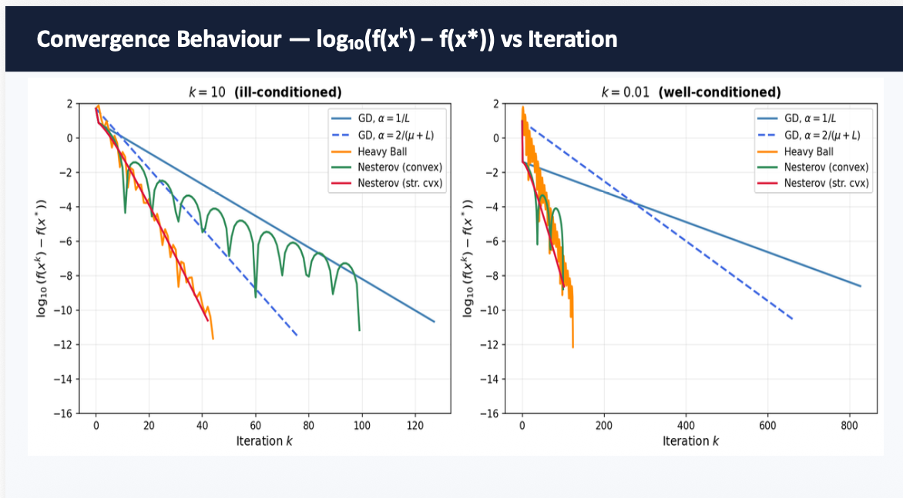
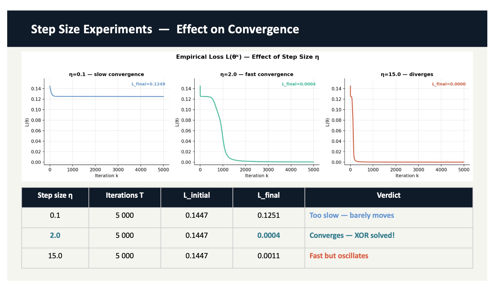
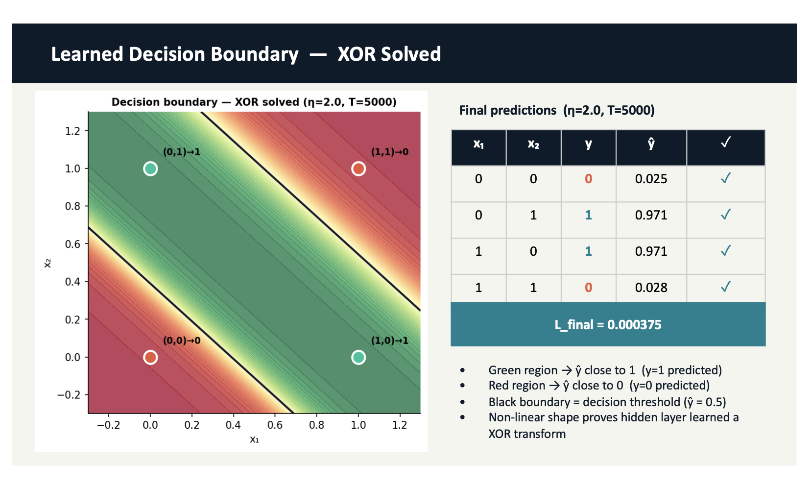

# Optimization for Data Science Projects

This repository summarizes selected coursework projects from the Optimization for Data Science course.

The work focuses on practical optimization methods used in machine learning and data science, including numerical optimization, gradient-based methods, neural network training, and accelerated optimization techniques.

## Topics Covered

- Gradient-based optimization
- Numerical optimization methods
- Neural network training
- Step size selection
- Accelerated gradient methods
- Visualization of optimization behavior

## Project Examples

### Gradient Descent and Step Size Analysis
Explored how different step sizes affect convergence behavior and optimization performance.

### Neural Network Optimization
Implemented and analyzed a small neural network training setup using gradient-based optimization.

### Accelerated Gradient Methods
Compared standard gradient descent with accelerated methods to study convergence speed and optimization efficiency.

## Visual Summaries

### Convergence Comparison

Comparison of gradient-based optimization methods, including Gradient Descent, Heavy Ball, and Nesterov methods.

### Step Size Experiments

Visualization of how different step sizes affect convergence behavior during neural network training.

### XOR Decision Boundary

Learned non-linear decision boundary showing how a small neural network can solve the XOR classification problem.

## Tools

Python, NumPy, Matplotlib, Jupyter Notebook

## Note

This repository is intended as a portfolio summary. It does not contain original assignment sheets or full coursework submissions.
